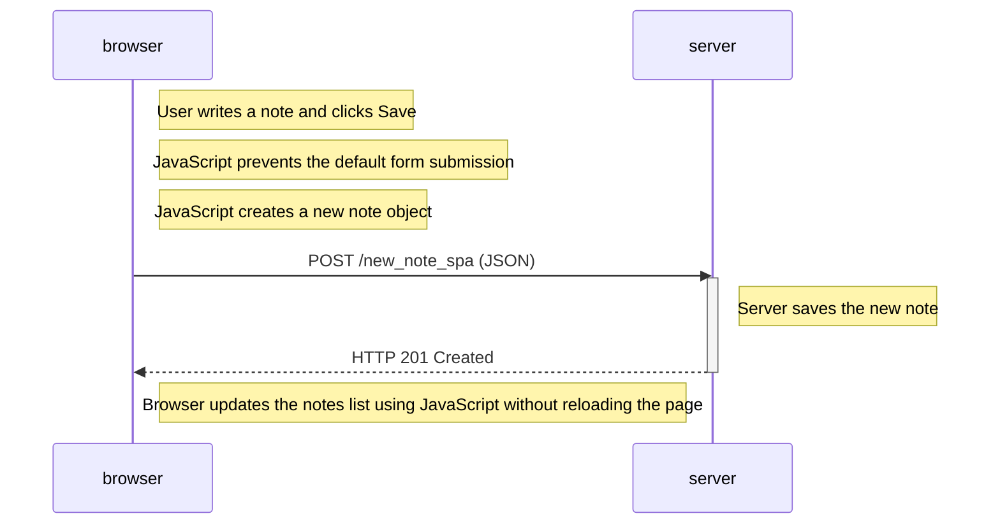

```mermaid
sequenceDiagram
    participant browser
    participant server

    Note right of browser: User writes a note and clicks Save

    Note right of browser: JavaScript prevents the default form submission

    Note right of browser: JavaScript creates a new note object

    browser->>server: POST /new_note_spa (JSON)
    activate server
    Note right of server: Server saves the new note
    server-->>browser: HTTP 201 Created
    deactivate server

    Note right of browser: Browser updates the notes list using JavaScript without reloading the page
```